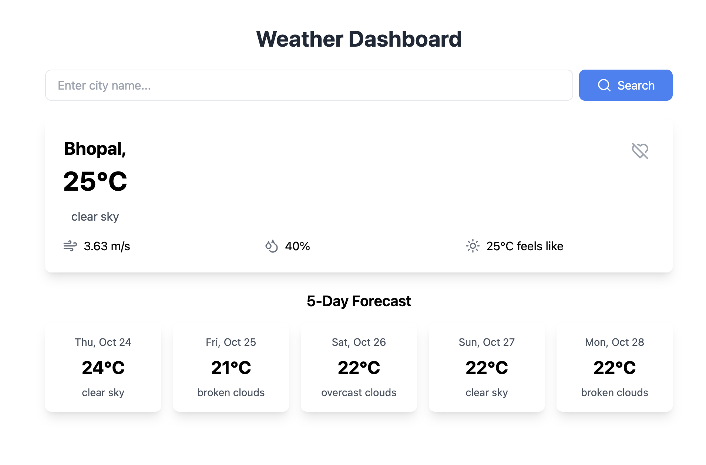

# Weather Application

A Weather application build with react.js, tailwind CSS and with [openweathermap](https://home.openweathermap.org/) API Key.

The user can enter the name of city or state and can find the relevant details such as :-

- Temperature
- Humidity 
- Wind Speed

Along with the forward 5 Days forecast.

User can also add the city and states as **favorites**, which will show the details of the place everytime, the user visit a app.

The data is stored in local storage. So the data will not be deleted on a page

It uses **tailwind CSS** for styling and **lucide-react** for icon components of Search , Heart, HeartOff, MapPin, Wind, Droplets, Sun.

## Screenshots

